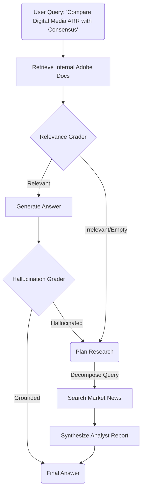

# Adobe AI Leadership Insight Agent 🧠🔴


## 1. Executive Summary
**Context**: Adobe leaders and analysts need to rapidly synthesize insights from complex internal documents (e.g., **Adobe Q4 FY2025 Earnings**, 10-K filings, Competitor Analysis) and cross-reference them with real-time market data.

**The Challenge**:
1.  **Data Silos**: Financial data is locked in dense PDFs and tables that standard LLMs struggle to parse accurately.
2.  **Trust**: Leadership cannot rely on "approximate" answers. A hallucination about Creative Cloud ARR or Digital Media growth is unacceptable.

**Our Solution**: An **Autonomous Agentic System** engineered specifically for high-fidelity financial analysis. It combines **Hybrid Search** (for precise metric retrieval) with **Self-Correction** (to guarantee grounding) and **Deep Research** (to contextualize internal metrics with external market news).

---

## 2. Solution Architecture

We implemented a **Cyclic State Graph** using `LangGraph` to model the cognitive workflow of a Senior Financial Analyst.



---

## 3. Technical Implementation: The "Adobe Quality" Standard

### 3.1 Structure-Aware Ingestion
Financial documents rely heavily on tables. Standard chunking destroys this context.
-   **Implementation**: We utilized `PyMuPDF` to detect and extract tables as distinct units, converting them to Markdown.
-   **Impact**: When a user asks about *"Digital Experience Segment Revenue"*, the model sees the row/column structure, preventing row-misalignment errors common in naive RAG.

### 3.2 Hybrid Retrieval with RRF
To answer questions like *"What was the YoY growth for Document Cloud?"*:
-   **Semantic Search (AWS Bedrock Titan)**: Understands "Document Cloud" matches concepts like "Acrobat" and "PDF solutions".
-   **Keyword Search (BM25)**: Ensures exact matches for specific fiscal years ("FY2025") and financial acronyms ("RPO", "ARR").
-   **Fusion**: We use **Reciprocal Rank Fusion (RRF)** to combine these signals, ensuring we don't miss the specific number while understanding the broad intent.

### 3.3 The "Analyst" Agent
The agent is designed with a **"Trust but Verify"** architecture:
-   **Hallucination Grader**: A specialized LLM node that acts as an auditor. It compares the generated answer against the retrieved 10-K snippets. If the answer claims *"Revenue grew 12%"* but the doc says *"10%"*, the agent **rejects the answer** and self-corrects.
-   **Deep Research Fallback**: If the user asks *"How did Adobe's stock react to the Firefly announcement?"* (data not in the PDF), the agent detects the gap and autonomously agents out to the web to find real-time market reaction.

---

## 4. Directory Structure

Designed for scalability and enterprise deployment.

```bash
adobe-ai-agent/
├── app.py                  # 🖥️ Streamlit Dashboard (Adobe Themed)
├── Dockerfile              # 🐳 Enterprise Base Image (Python 3.12-slim)
├── docker-compose.yml      # 🎻 Orchestration
├── requirements.txt        # 📦 Dependencies
├── scripts/                # 🛠️ Ops
│   ├── build_index.py      # ETL: PDF -> Intelligent Chunking -> ChromaDB
│   ├── serve.py            # FastAPI Microservice
│   └── start.sh            # Launch Script
└── src/                    # 🧠 Source Code
    ├── agent/              # LangGraph Workflow logic
    ├── chunking/           # Text splitting implementations
    ├── embeddings/         # Embedding generation (AWS Bedrock)
    ├── eval/               # LLM-as-a-Judge (Graders)
    ├── extraction/         # PDF Parsing & OCR
    ├── generation/         # RAG Generator & Citations
    ├── guardrails/         # Safety & Policy Checks
    ├── ingestion/          # Data Loading & Preparation
    ├── retrieval/          # Hybrid Retriever (BM25 + Semantic)
    ├── tools/              # Custom Tools (e.g. WebSearch)
    ├── ui/                 # Frontend Utilities
    └── vectorstore/        # ChromaDB Wrapper
```

---

## 5. Execution Instructions

### Prerequisites
-   **Docker** (Recommended for reproducibility)
-   **AWS Credentials** (Access to Bedrock for Claude 3.5 Sonnet)

### Quick Start
1.  **Configure**:
    ```bash
    cp .env.example .env
    # Add AWS credentials
    ```

2.  **Launch**:
    ```bash
    docker-compose up --build
    ```

3.  **Access**:
    -   **Analyst Dashboard**: [http://localhost:8501](http://localhost:8501)
    -   **API Endpoint**: [http://localhost:8000/docs](http://localhost:8000/docs)

---

## 6. Technical Stack & Module Architecture

### 6.1 Backend API Layer — FastAPI (`scripts/serve.py`)
The backend is a **FastAPI** microservice that exposes the agent as a REST API. On startup, it initializes all components (embeddings, vector store, retriever, generator, agent graph) and serves them via `/query` and `/health` endpoints. CORS middleware is enabled for frontend communication.

### 6.2 Agentic Orchestration — LangGraph (`src/agent/`)
- **`graph.py`** — Defines the `AgentState` (a `TypedDict` with fields like `documents`, `question`, `answer`, `research_queries`, `hallucination_grade`, `is_web`) and builds a `StateGraph` with 8 nodes:
  - `retrieve` → `grade_documents` → `generate` → `check_hallucination` → END
  - Conditional edges route to `transform_query` (retry) or `plan_research` → `web_search` → `synthesize_research` → END
- **`research.py`** — Contains `ResearchRefiner` (decomposes a complex question into 3+ sub-queries using an LLM) and `ResearchSynthesizer` (aggregates web results into a coherent report with citations). Both use `ChatBedrockConverse`.

### 6.3 Evaluation & Guardrails — LLM-as-a-Judge (`src/eval/`)
We implemented two dedicated grader classes, each backed by a zero-temperature LLM call for deterministic outputs:
- **`HallucinationGrader`** — Compares the generated answer against the retrieved context. Returns `yes`/`no` on whether the answer is grounded. If not grounded, the graph rejects the answer and falls back to web research.
- **`RelevanceGrader`** — Evaluates whether retrieved documents are actually relevant to the user's question before generation begins. This prevents "garbage in, garbage out" scenarios.

Both graders **fail open** (default to `relevant`/`grounded`) if the LLM call errors, to avoid blocking valid answers.

### 6.4 Retrieval — Hybrid Search with RRF (`src/retrieval/`)
The `DocumentRetriever` class implements a manual **Reciprocal Rank Fusion** algorithm:
1.  **BM25 (Sparse)** — Initialized from all indexed documents using `langchain_community.retrievers.BM25Retriever`.
2.  **ChromaDB (Dense)** — Semantic similarity search via AWS Bedrock Titan embeddings.
3.  **Fusion** — Each result gets a score of `1/(60 + rank)` from each retriever. Scores are summed and sorted. Top-K documents are returned.

### 6.5 Extraction & Chunking (`src/extraction/`, `src/chunking/`)
- **`PDFExtractor`** — Uses `PyMuPDF (fitz)` to extract text, tables (converted to Markdown), and images per page. Output is staged as JSON files.
- **`IntelligentChunker`** — Reads staged JSON, splits by logical sections (respecting headings), and creates separate chunks for tables and images. Each chunk carries metadata: `page`, `type`, `section_heading`, `chunk_size`.

### 6.6 Generation (`src/generation/`)
- **`AnswerGenerator`** — Uses `ChatBedrockConverse` (Claude / Nova) with a structured system prompt to generate answers grounded in retrieved context.
- **`CitationAwareGenerator`** — Extends generation with inline citation numbers mapped to source documents and page numbers.

### 6.7 Tools (`src/tools/`)
- **`WebSearchTool`** — Wraps `DuckDuckGo Search (DDGS)`. Accepts a single query or a list of queries (from the research planner). Limits results per query (3 for multi-query, 5 for single) to keep context manageable.

### 6.8 Frontend (`app.py`, `src/ui/`)
- **Streamlit** dashboard with two modes: **Index Mode** (queries the FastAPI backend with pre-indexed data) and **Upload Mode** (processes documents in-memory for ad-hoc analysis).
- Custom Adobe-themed styling via `src/ui/styles.py`.

### 6.9 Infrastructure (`Dockerfile`, `docker-compose.yml`)
- **Multi-stage Docker build** using `python:3.12-slim`.
- **docker-compose** orchestrates the full stack (FastAPI + Streamlit) with environment variable injection and volume mounts for persistent indexes.

