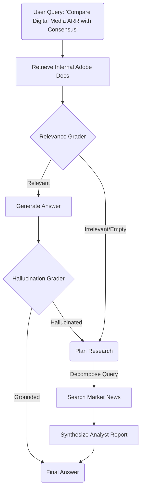

# Adobe AI Leadership Insight Agent 🧠🔴


## 1. Executive Summary
**Context**: Adobe leaders and analysts need to rapidly synthesize insights from complex internal documents (e.g., **Adobe Q4 FY2025 Earnings**, 10-K filings, Competitor Analysis) and cross-reference them with real-time market data.

**The Challenge**:
1.  **Data Silos**: Financial data is locked in dense PDFs and tables that standard LLMs struggle to parse accurately.
2.  **Trust**: Leadership cannot rely on "approximate" answers. A hallucination about Creative Cloud ARR or Digital Media growth is unacceptable.

**Our Solution**: An **Autonomous Agentic System** engineered specifically for high-fidelity financial analysis. It combines **Hybrid Search** (for precise metric retrieval) with **Self-Correction** (to guarantee grounding) and **Deep Research** (to contextualize internal metrics with external market news).

---

## 2. Solution Architecture

We implemented a **Cyclic State Graph** using `LangGraph` to model the cognitive workflow of a Senior Financial Analyst.



---

## 3. Technical Implementation: The "Adobe Quality" Standard

### 3.1 Structure-Aware Ingestion
Financial documents rely heavily on tables. Standard chunking destroys this context.
-   **Implementation**: We utilized `PyMuPDF` to detect and extract tables as distinct units, converting them to Markdown.
-   **Impact**: When a user asks about *"Digital Experience Segment Revenue"*, the model sees the row/column structure, preventing row-misalignment errors common in naive RAG.

### 3.2 Hybrid Retrieval with RRF
To answer questions like *"What was the YoY growth for Document Cloud?"*:
-   **Semantic Search (AWS Bedrock Titan)**: Understands "Document Cloud" matches concepts like "Acrobat" and "PDF solutions".
-   **Keyword Search (BM25)**: Ensures exact matches for specific fiscal years ("FY2025") and financial acronyms ("RPO", "ARR").
-   **Fusion**: We use **Reciprocal Rank Fusion (RRF)** to combine these signals, ensuring we don't miss the specific number while understanding the broad intent.

### 3.3 The "Analyst" Agent
The agent is designed with a **"Trust but Verify"** architecture:
-   **Hallucination Grader**: A specialized LLM node that acts as an auditor. It compares the generated answer against the retrieved 10-K snippets. If the answer claims *"Revenue grew 12%"* but the doc says *"10%"*, the agent **rejects the answer** and self-corrects.
-   **Deep Research Fallback**: If the user asks *"How did Adobe's stock react to the Firefly announcement?"* (data not in the PDF), the agent detects the gap and autonomously agents out to the web to find real-time market reaction.

---

## 4. Directory Structure

Designed for scalability and enterprise deployment.

```bash
adobe-ai-agent/
├── app.py                  # 🖥️ Streamlit Dashboard (Adobe Themed)
├── Dockerfile              # 🐳 Enterprise Base Image (Python 3.12-slim)
├── docker-compose.yml      # 🎻 Orchestration
├── requirements.txt        # 📦 Dependencies
├── scripts/                # 🛠️ Ops
│   ├── build_index.py      # ETL: PDF -> Intelligent Chunking -> ChromaDB
│   ├── serve.py            # FastAPI Microservice
│   └── start.sh            # Launch Script
└── src/                    # 🧠 Source Code
    ├── agent/              # LangGraph Workflow logic
    ├── chunking/           # Text splitting implementations
    ├── embeddings/         # Embedding generation (AWS Bedrock)
    ├── eval/               # LLM-as-a-Judge (Graders)
    ├── extraction/         # PDF Parsing & OCR
    ├── generation/         # RAG Generator & Citations
    ├── guardrails/         # Safety & Policy Checks
    ├── ingestion/          # Data Loading & Preparation
    ├── retrieval/          # Hybrid Retriever (BM25 + Semantic)
    ├── tools/              # Custom Tools (e.g. WebSearch)
    ├── ui/                 # Frontend Utilities
    └── vectorstore/        # ChromaDB Wrapper
```

---

## 5. Execution Instructions

### Prerequisites
-   **Docker** (Recommended for reproducibility)
-   **AWS Credentials** (Access to Bedrock for Claude 3.5 Sonnet)

### Quick Start
1.  **Configure**:
    ```bash
    cp .env.example .env
    # Add AWS credentials
    ```

2.  **Launch**:
    ```bash
    docker-compose up --build
    ```

3.  **Access**:
    -   **Analyst Dashboard**: [http://localhost:8501](http://localhost:8501)
    -   **API Endpoint**: [http://localhost:8000/docs](http://localhost:8000/docs)

---

## 6. Enterprise Considerations & Scalability

-   **Security**: The system is designed to run entirely within a VPC. No data is sent to external model providers (using private AWS Bedrock endpoints).
-   **Observability**: The `LangGraph` architecture emits events for every state transition, allowing full audit trails of *why* the agent made a specific decision.
-   **Future Integrations**:
    -   **Adobe PDF Services API**: For superior extraction of complex layout in marketing brochures.
    -   **AEP (Adobe Experience Platform)**: Potential to ingest customer journey data for richer insights.

---

## 7. Challenge Outcome
This submission demonstrates not just "RAG," but a **resilient, self-healing system** capable of handling the nuance required for high-level business intelligence at Adobe.
